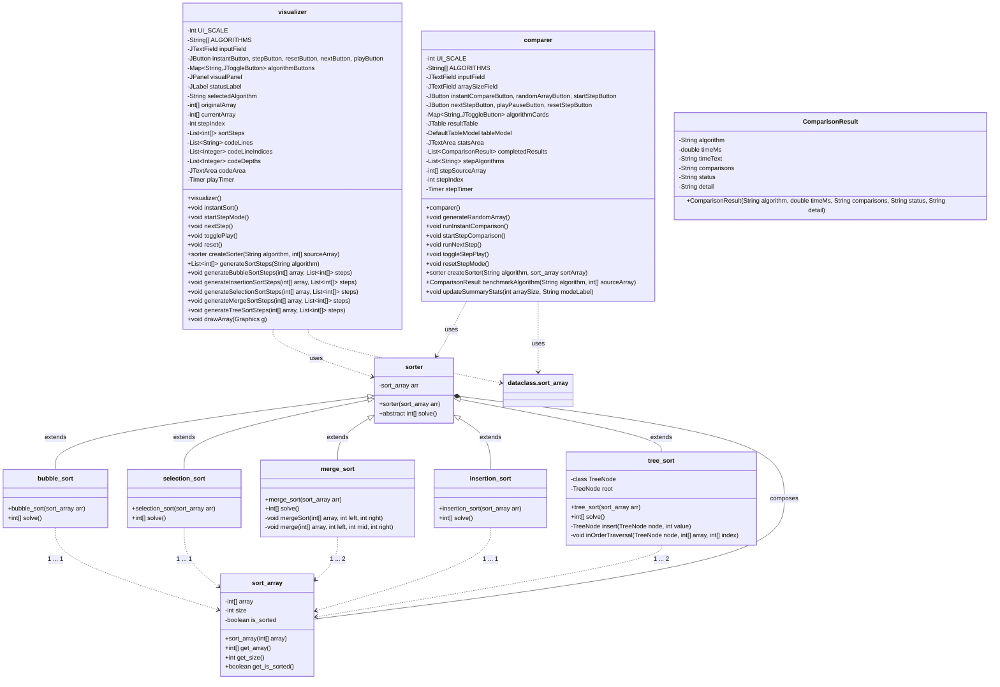

```mermaid
classDiagram
direction TB

    class visualizer {
        -int UI_SCALE
        -String[] ALGORITHMS
        -JTextField inputField
        -JButton instantButton, stepButton, resetButton, nextButton, playButton
        -Map~String,JToggleButton~ algorithmButtons
        -JPanel visualPanel
        -JLabel statusLabel
        -String selectedAlgorithm
        -int[] originalArray
        -int[] currentArray
        -int stepIndex
        -List~int[]~ sortSteps
        -List~String~ codeLines
        -List~Integer~ codeLineIndices
        -List~Integer~ codeDepths
        -JTextArea codeArea
        -Timer playTimer
        +visualizer()
        +void instantSort()
        +void startStepMode()
        +void nextStep()
        +void togglePlay()
        +void reset()
        +sorter createSorter(String algorithm, int[] sourceArray)
        +List~int[]~ generateSortSteps(String algorithm)
        +void generateBubbleSortSteps(int[] array, List~int[]~ steps)
        +void generateInsertionSortSteps(int[] array, List~int[]~ steps)
        +void generateSelectionSortSteps(int[] array, List~int[]~ steps)
        +void generateMergeSortSteps(int[] array, List~int[]~ steps)
        +void generateTreeSortSteps(int[] array, List~int[]~ steps)
        +void drawArray(Graphics g)
    }

    class sort_array {
        -int[] array
        -int size
        -boolean is_sorted
        +sort_array(int[] array)
        +int[] get_array()
        +int get_size()
        +boolean get_is_sorted()
    }

    class sorter {
        -sort_array arr
        +sorter(sort_array arr)
        +abstract int[] solve()
    }

    class bubble_sort {
        +bubble_sort(sort_array arr)
        +int[] solve()
    }

    class selection_sort {
        +selection_sort(sort_array arr)
        +int[] solve()
    }

    class merge_sort {
        +merge_sort(sort_array arr)
        +int[] solve()
        -void mergeSort(int[] array, int left, int right)
        -void merge(int[] array, int left, int mid, int right)
    }

    class insertion_sort {
        +insertion_sort(sort_array arr)
        +int[] solve()
    }

    class tree_sort {
        +tree_sort(sort_array arr)
        +int[] solve()
        -class TreeNode
        -TreeNode root
        -TreeNode insert(TreeNode node, int value)
        -void inOrderTraversal(TreeNode node, int[] array, int[] index)
    }

    class comparer {
        -int UI_SCALE
        -String[] ALGORITHMS
        -JTextField inputField
        -JTextField arraySizeField
        -JButton instantCompareButton, randomArrayButton, startStepButton
        -JButton nextStepButton, playPauseButton, resetStepButton
        -Map~String,JToggleButton~ algorithmCards
        -JTable resultTable
        -DefaultTableModel tableModel
        -JTextArea statsArea
        -List~ComparisonResult~ completedResults
        -List~String~ stepAlgorithms
        -int[] stepSourceArray
        -int stepIndex
        -Timer stepTimer
        +comparer()
        +void generateRandomArray()
        +void runInstantComparison()
        +void startStepComparison()
        +void runNextStep()
        +void toggleStepPlay()
        +void resetStepMode()
        +sorter createSorter(String algorithm, sort_array sortArray)
        +ComparisonResult benchmarkAlgorithm(String algorithm, int[] sourceArray)
        +void updateSummaryStats(int arraySize, String modeLabel)
    }

    class ComparisonResult {
        -String algorithm
        -double timeMs
        -String timeText
        -String comparisons
        -String status
        -String detail
        +ComparisonResult(String algorithm, double timeMs, String comparisons, String status, String detail)
    }

    sorter <|-- bubble_sort : extends
    sorter <|-- selection_sort : extends
    sorter <|-- merge_sort : extends
    sorter <|-- insertion_sort : extends
    sorter <|-- tree_sort : extends
    sorter *-- sort_array : composes
    bubble_sort ..> sort_array : 1 ... 1
    selection_sort ..> sort_array : 1 ... 1
    merge_sort ..> sort_array : 1 ... 2
    insertion_sort ..> sort_array : 1 ... 1
    tree_sort ..> sort_array : 1 ... 2
    visualizer ..> sorter : uses
    comparer ..> sorter : uses
    comparer ..> dataclass.sort_array : uses
    visualizer ..> dataclass.sort_array : uses
```