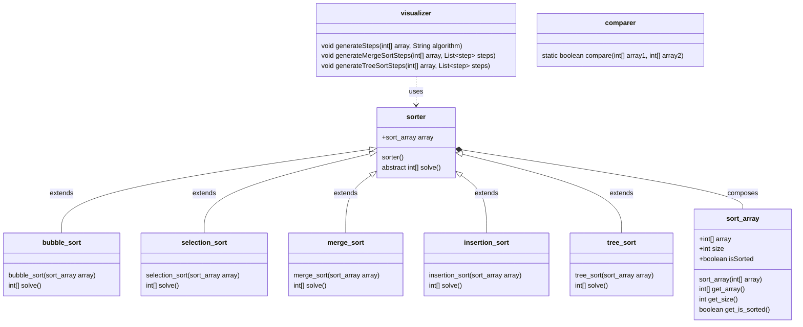

```mermaid
classDiagram
direction TB
    class visualizer {
        void generateSteps(int[] array, String algorithm)
        void generateMergeSortSteps(int[] array, List~step~ steps)
        void generateTreeSortSteps(int[] array, List~step~ steps)
    }
    class sort_array {
        +int[] array
        +int size
        +boolean isSorted
        sort_array(int[] array)
        int[] get_array()
        int get_size()
        boolean get_is_sorted()
    }
    class sorter {
        +sort_array array
        sorter()
        abstract int[] solve()
    }
    class bubble_sort {
        bubble_sort(sort_array array)
        int[] solve()
    }
    class selection_sort {
        selection_sort(sort_array array)
        int[] solve()
    }
    class merge_sort {
        merge_sort(sort_array array)
        int[] solve()
    }
    class insertion_sort {
        insertion_sort(sort_array array)
        int[] solve()
    }
    class tree_sort {
        tree_sort(sort_array array)
        int[] solve()
    }

    class comparer {
        static boolean compare(int[] array1, int[] array2)
    }

    sorter <|-- bubble_sort : extends
    sorter <|-- selection_sort : extends
    sorter <|-- merge_sort : extends  
    sorter <|-- insertion_sort : extends
    sorter <|-- tree_sort : extends
    sorter *-- sort_array : composes
    visualizer ..> sorter : uses
```