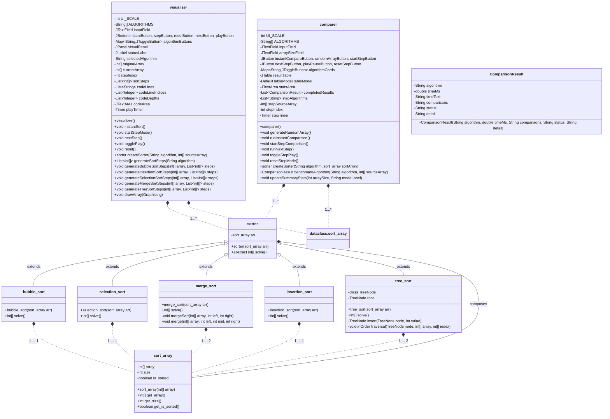

# Algorithm Visualizer
This is a school project for OOP.
## Project requirements
The goal is to implement at least:
- 5 classes
- 1 array
- 1 inheritance relationship
- 1 1...1 relationship
- 1 1...* relationship
- encapsulation
- implementation of an appealing project idea

## Current Implementation
The current project implements these requirements as follows:
- 5 classes: `sorter`, `bubble_sort`, `selection_sort`, `merge_sort`, `insertion_sort`, `tree_sort`, `sort_array`, `visualizer`, `comparer`
- 1 array: `int[] array`
- 1 inheritance relationship: `sorter` is the parent class of `bubble_sort`, `selection_sort`, `merge_sort`, `insertion_sort`, and `tree_sort`
- 1 1...1 relationship: `sort_array` has a 1...1 relationship with `sorter`
- 1 1...* relationship: `visualizer` has a 1...* relationship with `sorter`
- encapsulation: The classes encapsulate their data and provide public methods for interaction
- implementation of an appealing project idea: The project visualizes the sorting process of different algorithms, making it an engaging way to learn about sorting algorithms.

## Current TODOs
The implementation is still in progress, and the following tasks are yet to be completed:
- make the `visualizer` class also have a "select" or "regarding" state.
- implement the comparer to use the `visualizer`
- add a `visualizer` extention to add a visualization for sorting algorithms with O(2n) storage complexity, such as tree sort.
- implement more sorting algorithms, such as miracle sort, bogosort, dictator sort and thanos sort

## requirements.txt
```
# No external libraries are required for this project as it is implemented using standard Java libraries.
```

## How to run
To run the project, follow these steps:
1. Ensure you have Java installed on your system.
2. Compile the Java files in the `src` directory.
3. Run the `main` class to start the visualizer.

## Project structure
```
src/
├── main/
|   └── main.java
│   └── comparer.java
|   └── visualizer.java
├── dataclass/
│   └── sort_array.java
└── sorter/
    ├── bubble_sort.java
    ├── insertion_sort.java
    ├── merge_sort.java
    ├── selection_sort.java
    ├── sorter.java
    └── tree_sort.java

```

## Class Diagram



# README DE
Dies ist ein Schulprojekt für OOP.
## Projektanforderungen
Das Ziel ist es, mindestens zu implementieren:
- 5 Klassen
- 1 Array
- 1 Vererbungsbeziehung
- 1 1...1 Beziehung
- 1 1...* Beziehung
- Datenkapselung
- Umsetzung einer ansprechenden Projektidee
## Aktuelle Implementierung
Die aktuelle Implementierung erfüllt diese Anforderungen wie folgt:
- 5 Klassen: `sorter`, `bubble_sort`, `selection_sort`, `merge_sort`, `insertion_sort`, `tree_sort`, `sort_array`, `visualizer`, `comparer`
- 1 Array: `int[] array`
- 1 Vererbungsbeziehung: `sorter` ist die Elternklasse von `bubble_sort`, `selection_sort`, `merge_sort`, `insertion_sort` und `tree_sort`
- 1 1...1 Beziehung: `sort_array` hat eine 1...1 Beziehung mit `sorter`
- 1 1...* Beziehung: `visualizer` hat eine 1...* Beziehung mit `sorter`
- Datenkapselung: Die Klassen kapseln ihre Daten und bieten öffentliche Methoden für die Interaktion
- Umsetzung einer ansprechenden Projektidee: Das Projekt visualisiert den Sortierprozess verschiedener Algorithmen, was eine ansprechende Möglichkeit bietet, mehr über Sortieralgorithmen zu lernen.
## Aktuelle TODOs
Die Implementierung ist noch in Arbeit, und die folgenden Aufgaben müssen noch erledigt werden:
- Die `visualizer` Klasse soll auch einen "select" oder "regarding" Zustand haben.
- Implementieren des `comparer`, um den `visualizer` zu verwenden
- Hinzufügen einer `visualizer` Erweiterung, um eine Visualisierung für Sortieralgorithmen mit O(2n) Speicherkomplexität zu erstellen, wie z.B. Tree Sort.
- Implementieren weiterer Sortieralgorithmen, wie Miracle Sort, Bogosort, Dictator Sort und Thanos Sort
## requirements.txt
```
# Für dieses Projekt sind keine externen Bibliotheken erforderlich, da es mit den Standard-Java-Bibliotheken implementiert ist.
```
## Anwendungsanleitung
Um das Projekt auszuführen, folgen Sie diesen Schritten:
1. Stellen Sie sicher, dass Java auf Ihrem System installiert ist.
2. Kompilieren Sie die Java-Dateien im `src` Verzeichnis.
3. Führen Sie die `main` Klasse aus, um den Visualizer zu starten.
## Projektstruktur
```src/
├── main/
|   └── main.java
│   └── comparer.java
|   └── visualizer.java
├── dataclass/
│   └── sort_array.java
└── sorter/
    ├── bubble_sort.java
    ├── insertion_sort.java
    ├── merge_sort.java
    ├── selection_sort.java
    ├── sorter.java
    └── tree_sort.java
```

