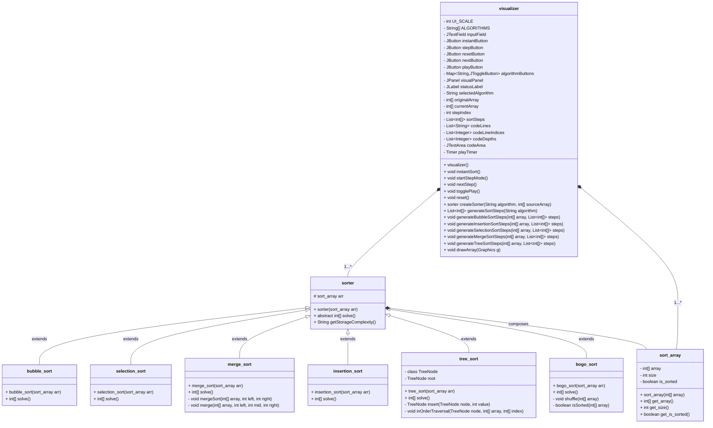

```mermaid
classDiagram
direction TB

    class visualizer {
        - int UI_SCALE
        - String[] ALGORITHMS
        - JTextField inputField
        - JButton instantButton
        - JButton stepButton
        - JButton resetButton
        - JButton nextButton
        - JButton playButton
        - Map~String,JToggleButton~ algorithmButtons
        - JPanel visualPanel
        - JLabel statusLabel
        - String selectedAlgorithm
        - int[] originalArray
        - int[] currentArray
        - int stepIndex
        - List~int[]~ sortSteps
        - List~String~ codeLines
        - List~Integer~ codeLineIndices
        - List~Integer~ codeDepths
        - JTextArea codeArea
        - Timer playTimer
        + visualizer()
        + void instantSort()
        + void startStepMode()
        + void nextStep()
        + void togglePlay()
        + void reset()
        + sorter createSorter(String algorithm, int[] sourceArray)
        + List~int[]~ generateSortSteps(String algorithm)
        + void generateBubbleSortSteps(int[] array, List~int[]~ steps)
        + void generateInsertionSortSteps(int[] array, List~int[]~ steps)
        + void generateSelectionSortSteps(int[] array, List~int[]~ steps)
        + void generateMergeSortSteps(int[] array, List~int[]~ steps)
        + void generateTreeSortSteps(int[] array, List~int[]~ steps)
        + void drawArray(Graphics g)
    }

    class sort_array {
        - int[] array
        - int size
        - boolean is_sorted
        + sort_array(int[] array)
        + int[] get_array()
        + int get_size()
        + boolean get_is_sorted()
    }

    class sorter {
        # sort_array arr
        + sorter(sort_array arr)
        + abstract int[] solve()
        + String getStorageComplexity()
    }

    class bubble_sort {
        + bubble_sort(sort_array arr)
        + int[] solve()
    }

    class selection_sort {
        + selection_sort(sort_array arr)
        + int[] solve()
    }

    class merge_sort {
        + merge_sort(sort_array arr)
        + int[] solve()
        - void mergeSort(int[] array, int left, int right)
        - void merge(int[] array, int left, int mid, int right)
    }

    class insertion_sort {
        + insertion_sort(sort_array arr)
        + int[] solve()
    }

    class tree_sort {
        + tree_sort(sort_array arr)
        + int[] solve()
        - class TreeNode
        - TreeNode root
        - TreeNode insert(TreeNode node, int value)
        - void inOrderTraversal(TreeNode node, int[] array, int[] index)
    }

    class bogo_sort {
        + bogo_sort(sort_array arr)
        + int[] solve()
        - void shuffle(int[] array)
        - boolean isSorted(int[] array)
    }

    sorter <|-- bubble_sort : extends
    sorter <|-- selection_sort : extends
    sorter <|-- merge_sort : extends
    sorter <|-- insertion_sort : extends
    sorter <|-- tree_sort : extends
    sorter <|-- bogo_sort : extends
    sorter *-- sort_array : composes
    visualizer *-- sorter : 1...*
    visualizer *-- sort_array : 1...*
```
